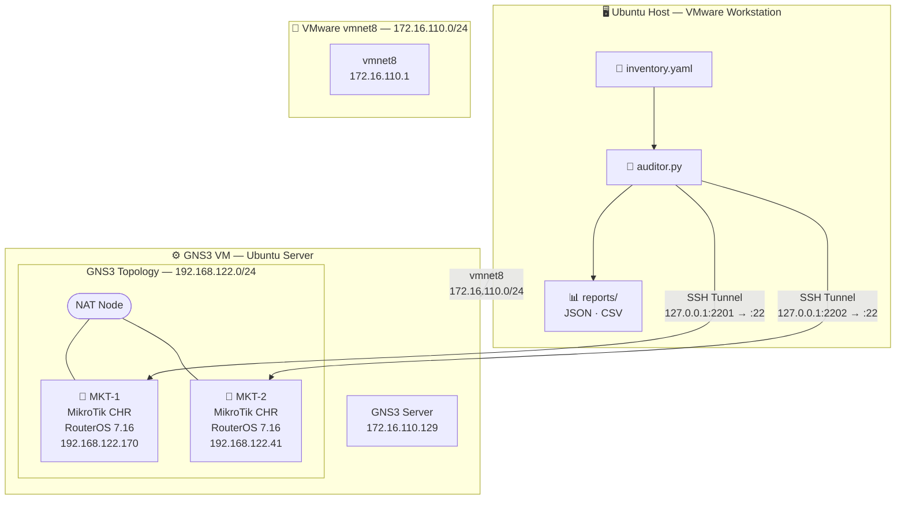

# Lab 01 — Network Auditor 🔍
### Automatización de auditoría de red con Python + Netmiko + MikroTik RouterOS

> **Parte del proyecto:** [network-automation-portfolio](../README.md) — una serie de laboratorios progresivos orientados al perfil **Network Automation / NetDevOps Engineer**.

---

## 📋 Descripción

Herramienta de auditoría automática de dispositivos MikroTik RouterOS vía SSH. El script se conecta a múltiples routers definidos en un inventario YAML, recolecta información de sistema e interfaces, y genera reportes estructurados en formato **JSON** y **CSV** — listos para ser consumidos por otras herramientas o dashboards.

Este tipo de automatización reemplaza el proceso manual de conectarse router por router para relevar el estado de la red, un flujo de trabajo real en entornos de ISPs, carriers y empresas con infraestructura multi-site.

---

## 🗺️ Topología del laboratorio



---

## 🛠️ Stack tecnológico

| Capa | Tecnología |
|---|---|
| Lenguaje | Python 3.10+ |
| Conectividad SSH | Netmiko 4.x |
| Parseo de inventario | PyYAML |
| Virtualización de red | GNS3 + VMware |
| Equipos simulados | MikroTik CHR (RouterOS 7.16) |
| Formato de reportes | JSON + CSV |

---

## 📁 Estructura del proyecto

```
lab01-network-auditor/
├── auditor.py          # Script principal
├── inventory.yaml      # Inventario de dispositivos
├── reports/            # Reportes generados (gitignored)
├── requirements.txt    # Dependencias Python
├── .gitignore
└── README.md
```

---

## ⚙️ Instalación

### Requisitos previos
- Python 3.10+
- GNS3 con GNS3 VM (VMware)
- Imagen MikroTik CHR (.img) importada en GNS3

### 1. Clonar el repositorio

```bash
git clone https://github.com/tuusuario/network-automation-portfolio
cd network-automation-portfolio/lab01-network-auditor
```

### 2. Crear entorno virtual e instalar dependencias

```bash
python3 -m venv venv
source venv/bin/activate
pip install -r requirements.txt
```

### 3. Configurar el inventario

Editá `inventory.yaml` con las IPs y credenciales de tus dispositivos:

```yaml
devices:
  - hostname: 127.0.0.1
    port: 2201
    device_type: mikrotik_routeros
    username: netauto
    password: "Lab123!"
    name: MKT-1

  - hostname: 127.0.0.1
    port: 2202
    device_type: mikrotik_routeros
    username: netauto
    password: "Lab123!"
    name: MKT-2
```

### 4. Abrir los túneles SSH (si corrés el script desde el host)

```bash
# Terminal 1
ssh -L 2201:192.168.122.170:22 gns3@172.16.110.129 -N

# Terminal 2
ssh -L 2202:192.168.122.41:22 gns3@172.16.110.129 -N
```

### 5. Correr el script

```bash
python auditor.py
```

---

## 📊 Output de ejemplo

```
[*] Iniciando auditoría de 2 dispositivos...

[+] Conectando a MKT-1 (127.0.0.1)...
    ✓ MKT-1 auditado correctamente
[+] Conectando a MKT-2 (127.0.0.1)...
    ✓ MKT-2 auditado correctamente

==================================================
         RESUMEN DE AUDITORÍA
==================================================

  Dispositivo : MKT-1 (127.0.0.1)
  Estado      : reachable
  RouterOS    : 7.16 (stable)
  CPU Load    : 2%
  Free Memory : 173.0MiB
  Interfaces  : 1 encontradas
    ↳ ether1       192.168.122.170/24   disabled=false

  Dispositivo : MKT-2 (127.0.0.1)
  Estado      : reachable
  RouterOS    : 7.16 (stable)
  CPU Load    : 36%
  Free Memory : 173.6MiB
  Interfaces  : 1 encontradas
    ↳ ether1       192.168.122.41/24    disabled=false

==================================================

[✓] Reporte JSON guardado: reports/audit_20260322_143022.json
[✓] Reporte CSV guardado:  reports/audit_20260322_143022.csv
```

### Reporte JSON generado

```json
[
  {
    "name": "MKT-1",
    "hostname": "127.0.0.1",
    "status": "reachable",
    "routeros_version": "7.16 (stable)",
    "interfaces": [
      {
        "interface": "ether1",
        "address": "192.168.122.170/24",
        "network": "192.168.122.0",
        "disabled": "false"
      }
    ],
    "cpu_load": "2%",
    "free_memory_mb": "173.0MiB",
    "timestamp": "2026-03-22T14:30:22"
  }
]
```

---

## 🗺️ Roadmap del portfolio

| Lab | Descripción | Estado |
|---|---|---|
| **Lab 01** | Network Auditor — Python + Netmiko + MikroTik | ✅ Completo |
| Lab 02 | Ansible Playbooks para MikroTik RouterOS | 🔜 Próximo |
| Lab 03 | Ansible Playbooks para Cisco IOS | ⏳ Pendiente |
| Lab 04 | Templates de configuración con Jinja2 | ⏳ Pendiente |
| Lab 05 | Stack de monitoreo — Docker + Prometheus + Grafana + SNMP | ⏳ Pendiente |
| Lab 06 | Topology Mapper con LLDP/CDP + NetworkX | ⏳ Pendiente |

---

## 📄 Licencia

MIT License — libre para usar y modificar con atribución.
