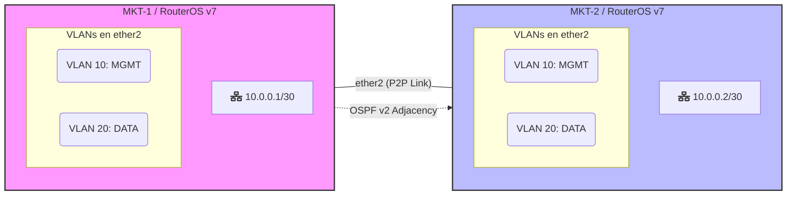

# MikroTik Automation with Ansible - Lab 02

Este repositorio contiene un laboratorio completo de automatización para routers **MikroTik RouterOS (v7.x)** utilizando **Ansible**. El objetivo es configurar la gestión de usuarios, segmentación de red (VLANs), enrutamiento dinámico (OSPF) y reglas de firewall de forma totalmente automatizada.

---

## 🌐 Escenario del Laboratorio



La topología consiste en dos routers MikroTik CHR conectados de forma punto a punto:

- **MKT-1:** Router de borde/núcleo (ID: 1.1.1.1)
- **MKT-2:** Router de borde/núcleo (ID: 2.2.2.2)
- **Enlace P2P:** Red `10.0.0.0/30` en la interfaz `ether2`.
- **VLANs:** MANAGEMENT (ID 10) y DATA (ID 20) configuradas sobre `ether2`.

### Arquitectura de Gestión
Ansible se conecta a través de la **API de RouterOS** (puerto 8728) utilizando túneles SSH para mayor seguridad y alcanzar los routers en un entorno virtualizado (GNS3).

```text
Host (Ansible)  --> [Túnel SSH] --> [GNS3 VM] --> MikroTik API (8728)
```

---

## 📁 Estructura del Proyecto

```text
lab02-ansible-mikrotik/
├── ansible.cfg              # Configuración base de Ansible
├── inventory.ini            # Definición de hosts y variables de conexión
├── site.yaml                # Playbook maestro (importa todos los demás)
├── group_vars/
│   └── mikrotik.yaml        # Variables globales (usuarios, VLANs, etc.)
├── host_vars/
│   ├── MKT-1.yaml           # Variables específicas de MKT-1 (Router-ID, IP P2P)
│   └── MKT-2.yaml           # Variables específicas de MKT-2 (Router-ID, IP P2P)
└── playbooks/
    ├── 01_users_ssh.yaml    # Gestión de usuarios y servicios
    ├── 02_interfaces_vlans.yaml # Configuración de Capa 2 e IPs
    ├── 03_routing.yaml      # Enrutamiento dinámico OSPF v7
    └── 04_firewall.yaml     # Reglas de seguridad básicas
```

---

## 🛠️ Requisitos Previos

### 1. Dependencias locales
Es necesario contar con Ansible y la librería Python `librouteros` instalada:
```bash
pip install librouteros
```

### 2. Colección de Ansible
Instalar la colección oficial de MikroTik:
```bash
ansible-galaxy collection install community.routeros
```

### 3. Conectividad (Túneles SSH)
Para alcanzar los routers a través del puerto de la API (8728), abre dos terminales y ejecuta los túneles:
```bash
# Terminal 1 - Para MKT-1
ssh -L 2201:192.168.122.170:8728 gns3@172.16.110.129 -N

# Terminal 2 - Para MKT-2
ssh -L 2202:192.168.122.41:8728 gns3@172.16.110.129 -N
```

---

## 🚀 Uso y Ejecución

### 1. Verificar conectividad
Prueba que Ansible puede comunicarse con la API de los routers:
```bash
ansible mikrotik -m community.routeros.api_info -a "path='system identity'"
```

### 2. Simulación (Dry-run)
Verifica los cambios antes de aplicarlos:
```bash
ansible-playbook site.yaml --check
```

### 3. Aplicar configuración
Ejecuta el playbook maestro para configurar todo el laboratorio:
```bash
ansible-playbook site.yaml
```

---

## 💡 Notas Técnicas
- **Idempotencia:** Se utiliza el módulo `community.routeros.api_modify` para asegurar que las configuraciones solo se apliquen si hay diferencias.
- **RouterOS v7:** La configuración de OSPF sigue la nueva sintaxis requerida por v7 (instancias, áreas y templates de interfaces).
- **Seguridad:** Los accesos se realizan mediante un usuario dedicado (`netauto`) con permisos restringidos y comunicación vía API cifrada opcional.
